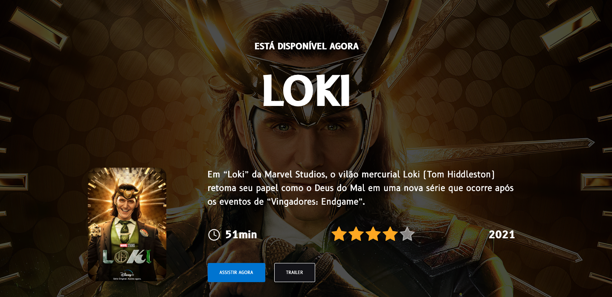

# Side Project Loki

  Link para o site em produção: - https://side-project-loki-angular.vercel.app/



## 💻 Sobre o projeto

Projeto desenvolvido com o propósito de praticar os conceitos básicos de Angular, tendo como tema principal o seriado Loki.

Utilizando as seguintes tecnologias:
  - [HTML](https://developer.mozilla.org/en-US/docs/Web/HTML);
  - [CSS](https://developer.mozilla.org/en-US/docs/Web/CSS);
  - [TYPESCRIPT](https://www.typescriptlang.org/);
  - [ANGULAR](https://angular.io/);

  ## 🚨 Como baixar o projeto

  Antes de começar, você vai precisar ter um editor para trabalhar com o código como VSCode.

  ### 🏁 Para rodar a aplicação

  ```bash
    # Clonar o repositório
    $ git clone https://github.com/milealmeida/side-project-loki-angular
    # Entrar no diretório
    $ cd {nomepasta}
    # Para abrir o Visual Studio Code
    $ code .
    # Instalar o projeto (digitar no terminal)
    $ npm install
    # Rodar o projeto na máquina (digitar no terminal)
    $ ng serve 
    # isso fará com que o projeto rode na `porta 
    http://localhost:4200/
``` 

  Desenvolvido com 💙 por Milena Almeida.
